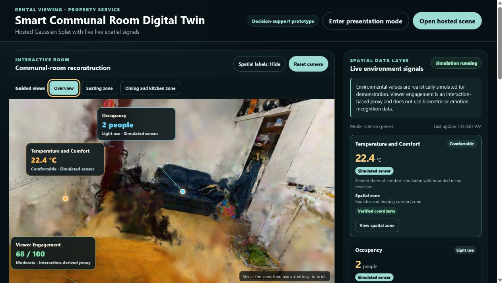
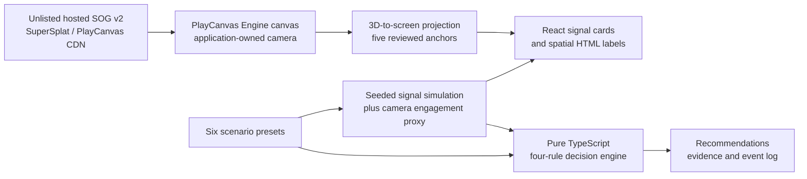

# Smart Communal Room Digital Twin

[](https://github.com/ChuanqiXu2024/smart-communal-room-digital-twin/actions/workflows/ci.yml)
[](https://github.com/ChuanqiXu2024/smart-communal-room-digital-twin/actions/workflows/pages.yml)
[](package.json)

## Final deliverables

- **Live prototype:** [Open the deployed application](https://chuanqixu2024.github.io/smart-communal-room-digital-twin/)
- **Presentation mode:** [Open the recording-oriented view](https://chuanqixu2024.github.io/smart-communal-room-digital-twin/?present=1)
- **Screen-recorded walkthrough:** [Watch the unlisted YouTube video](https://youtu.be/JQQHfM-ZF4s)
- **One-page academic write-up:** [Read the peer-reviewed academic summary](docs/write-up/digital-twin-student-accommodation-write-up.pdf)
- **Source repository:** [View the public GitHub repository](https://github.com/ChuanqiXu2024/smart-communal-room-digital-twin)

The environmental values are simulated, and Viewer Engagement is a navigation-based proxy rather than a biometric or emotion measure. The prototype's recommendations support, but do not replace, human property-management judgement.

This research prototype combines a browser-navigable Gaussian Splat of a real communal room with five spatially anchored live signals and a transparent property-service decision layer. A React interface owns the PlayCanvas camera, projects HTML labels from reviewed world coordinates, generates seeded and realistically noisy demonstration data, and turns exact rules into actionable recommendations that remain subject to human review.



## Project deliverables

| Deliverable | Status |
| --- | --- |
| Browser-based Gaussian Splat reconstruction | Complete |
| Five live spatial overlays | Complete |
| Transparent decision support | Complete |
| Public GitHub repository | Complete |
| Live browser deployment | Complete |
| One-page peer-reviewed write-up | Complete |
| Five-to-eight-minute walkthrough | Complete |

## Task requirement mapping

| Requirement | Implementation evidence |
| --- | --- |
| Photorealistic browser navigation | PlayCanvas Engine renders the unlisted hosted SuperSplat reconstruction with mouse, touch, keyboard, reset, and guided camera presets. |
| Gaussian Splatting or equivalent | The hosted scene is an unbundled SOG v2 Gaussian Splat with 438,067 Gaussians. |
| Five live spatial overlays | Five HTML labels are projected from approved world-space anchors on every render update. |
| Real or realistically simulated values with noise | A seeded, bounded simulation updates temperature, occupancy, lighting, and appliance state; engagement uses a noisy navigation proxy. |
| At least two actionable recommendations | Four transparent rules are available; the combined scenario activates exactly two recommendations. |
| Documented repository | Architecture, data, calibration, rules, privacy, accessibility, traceability, and release checks are documented under `docs/`. |

Full evidence is recorded in [requirements traceability](docs/requirements-traceability.md) and the [project deliverables](docs/project-deliverables.md).

## Key features

- Hosted photorealistic room without distributing the private source scan or a scene payload.
- Improved Overview reset plus Seating zone and Dining and kitchen zone camera presets.
- Five primary in-scene HTML labels with show/hide control, collision reduction, viewer-bound clamping, and compact mobile formatting.
- Matching accessible live-signal cards with a **View spatial zone** action.
- Seeded, bounded signal variation and six deterministic demonstration scenarios.
- Four inspectable decision rules with evidence, actions, outcomes, limitations, and a session-only event log.
- Presentation-focused `?present=1` mode that keeps the room, scenarios, signals, and recommendations close together.
- Typed loading failures, retry, a privacy-safe poster, and an official SuperSplat fallback link.
- Project-owned Vitest, Playwright, and axe checks enforced through continuous integration.

## Technology stack

- React `19.2.7` and TypeScript `6.0.3`
- Vite `8.1.5`
- PlayCanvas Engine `2.20.6`
- Vitest `4.1.10`
- Playwright `1.61.1`
- `@axe-core/playwright` `4.12.1`
- pnpm `11.9.0`

## Architecture



The primary application loads the absolute hosted metadata URL directly as a PlayCanvas `gsplat` asset. Per-frame projection stays outside React and updates the five label element positions. Lower-frequency signal state, scenarios, recommendations, and accessible text remain in small inspectable React and TypeScript modules. The official [SuperSplat scene](https://superspl.at/scene/d1aa30ae) is the reduced-function fallback.

See [hosted-scene architecture](docs/hosted-scene-architecture.md) for endpoint, CORS, privacy, and fallback evidence.

## Five spatial signals

| Signal | Physical placement | Provenance |
| --- | --- | --- |
| Temperature and Comfort | Radiator and heating-comfort zone | Seeded simulated sensor |
| Occupancy | Blue sofa and shared seating zone | Seeded simulated sensor |
| Lighting | Curtain, window, and primary-lighting zone | Seeded simulated sensor |
| Communal Appliance State | Non-essential communal countertop water boiler | Simulated device state |
| Viewer Engagement | Dining table and communal social focal point | Camera-navigation interaction proxy |

The exact approved coordinates remain in [the calibration artifact](docs/calibration/approved-hotspot-calibration.json). They must not be changed without a new visual review and explicit approval.

## Simulation and engagement disclosure

The environmental values are realistically simulated for demonstration; they are not measurements from a real property-management system. A fixed seed, bounded mean reversion, low-frequency occupancy changes, and safe scenario bands make noise reproducible without crossing documented rule thresholds.

Viewer Engagement is a camera-navigation proxy based on hotspot visibility, viewport centrality, dwell time, smoothing, and small seeded noise. It is not a validated behavioural measure and does not use identity, biometric, emotion-recognition, demographic, microphone, or camera data. See [data simulation](docs/data-simulation.md).

## Four transparent decision rules

| Rule | Exact trigger | Actionable recommendation |
| --- | --- | --- |
| Rule 1 — warm and occupied | Temperature `> 24°C` and occupancy `>= 3` | Prepare ventilation before the next viewing. |
| Rule 2 — poor presentation | Lighting `< 350 lux` and engagement `< 60/100` | Improve presentation of the communal focal zone. |
| Rule 3 — avoidable device use | Occupancy `== 0` and water boiler `ON` | Review the unused communal water boiler after a safety check. |
| Rule 4 — strong social-zone interest | Engagement `> 75/100` | Feature the communal social zone in the rental proposition. |

Ordinary noisy observations must support a changed rule state twice consecutively. Deliberate scenario changes apply immediately. Recommendations support, but never replace, human property-management judgement. Rule 3 is specific to the selected non-essential water boiler and must not be generalised to safety-critical or continuously powered equipment. See [decision layer](docs/decision-layer.md).

## Six reproducible scenarios

- **Normal communal use:** no active rule.
- **Warm and crowded:** Rule 1 only.
- **Poor presentation:** Rule 2 only.
- **Vacant room with water boiler left on:** Rule 3 only.
- **Strong interest:** Rule 4 only.
- **Combined viewing intervention:** exactly Rules 1 and 2.

Selecting a scenario sets its exact target and stable seed. Small later variation remains inside documented safe bands.

## Run locally

Prerequisites are Node.js 24 and pnpm 11.9.0. The room requires a network connection at runtime.

```powershell
pnpm install --frozen-lockfile
pnpm run dev
```

Open `http://127.0.0.1:4173/`. Drag to orbit, right-drag or Shift-drag to pan, and scroll or pinch to zoom. With the canvas focused, arrow keys orbit, Shift + arrow keys pan, `+`/`-` zoom, and `R` resets to Overview.

## Presentation mode

Open `http://127.0.0.1:4173/?present=1` or choose **Enter presentation mode** in the application. Presentation mode:

- keeps the viewer and all camera presets prominent;
- keeps five signals, six scenarios, and active recommendations accessible with less scrolling;
- collapses the recent event log by default while preserving its toggle;
- retains simulated-data and human-review disclosures;
- disables development calibration and never autoplays a scenario or camera motion.

Use the in-application control to return to the ordinary interface.

## Development-only calibration

Calibration is available only from a development build at `http://127.0.0.1:4173/?calibrate=1`. It uses PlayCanvas depth picking and keeps every edit session-local. It never edits repository files automatically. Calibration is not available in production or presentation mode.

See [hotspot calibration](docs/hotspot-calibration.md) before proposing any coordinate change.

## Testing

```powershell
pnpm install --frozen-lockfile
pnpm run typecheck
pnpm run lint
pnpm run test
pnpm exec playwright install chromium
pnpm run build
pnpm run test:e2e
pnpm run test:a11y
```

The functional Playwright suite covers loading, camera presets, reset, label visibility, normal/strong-interest/combined scenarios, presentation mode, mobile layout, and hosted-scene fallback. Automated axe checks cover ordinary desktop, presentation, mobile, and a two-recommendation state. Automation does not establish full WCAG conformance; see the [accessibility review](docs/accessibility-review.md). Production bundle evidence is recorded in the [performance review](docs/performance-review.md).

The active CI workflow runs frozen installation, type checking, lint, unit tests, build, functional browser tests, and accessibility tests sequentially on pushes and pull requests to `main`, plus manual dispatch. The deployment workflow repeats these checks before publishing the repository-subpath build to GitHub Pages.

## Privacy and ethics

The source PLY is private, ignored, untracked, and not distributed. The runtime scene is hosted externally as an unlisted scene, but anyone with its URL can access it. The project processes no real sensor or personal data and makes no autonomous property-management decision. Manual public acceptance and privacy review passed for this deployment on 2026-07-27; screenshots or the hosted representation still require a new review before reuse in another public context.

See [privacy and ethics](docs/privacy-and-ethics.md) and [NOTICE](NOTICE.md).

## Limitations

- Runtime rendering depends on an external, unlisted hosted scene and its current CORS behaviour.
- The captured room contains scan artefacts and is not a metrically validated building survey.
- Engagement is an interaction proxy, not a measure of attention, preference, emotion, or rental intent.
- HTML labels do not perform geometry-aware occlusion testing.
- Simulation and rule thresholds demonstrate an explainable workflow; they are not validated operational policy.
- PlayCanvas remains a large but isolated production chunk and still triggers Vite’s 500 kB advisory.
- Screen-reader users receive equivalent structured signal and recommendation text outside the WebGL canvas, not a semantic 3D scene.
- No resident or accommodation-manager task evaluation has been conducted.

## Future extensions

- Integrate consented, validated building sensors behind the existing typed signal boundary.
- Add geometry-aware label occlusion and optional user-authored viewpoints.
- Evaluate renter and property-service tasks with an approved study protocol.
- Validate thresholds with domain stakeholders and record provenance for every policy change.
- Add a resilient hosted-scene versioning and health-monitoring strategy.

## Repository structure

```text
.
├── .github/workflows/       # Active CI and GitHub Pages workflows
├── docs/                    # Architecture, evidence, project deliverables, and write-up
├── e2e/                     # Playwright functional and axe accessibility checks
├── src/
│   ├── calibration/         # Safe calibration export helpers
│   ├── components/          # Accessible UI and the PlayCanvas viewer bridge
│   ├── config/              # Hosted scene, camera presets, and approved hotspots
│   ├── decision/            # Pure rules, stability model, and decision hook
│   ├── playcanvas/          # Camera navigation controller
│   ├── scenarios/           # Six reproducible scenario definitions
│   └── simulation/          # Seeded live-data model
├── CONTRIBUTING.md          # Development and maintenance guidelines
├── CITATION.cff             # Public deployment citation metadata
├── NOTICE.md                # Distribution and reuse notice
├── PROJECT_PLAN.md          # Phased milestone record
├── package.json             # Pinned scripts and dependencies
└── pnpm-lock.yaml           # Reproducible dependency resolution
```

`source-private/`, `node_modules/`, build output, test artefacts, and local environment files are intentionally excluded from Git.
